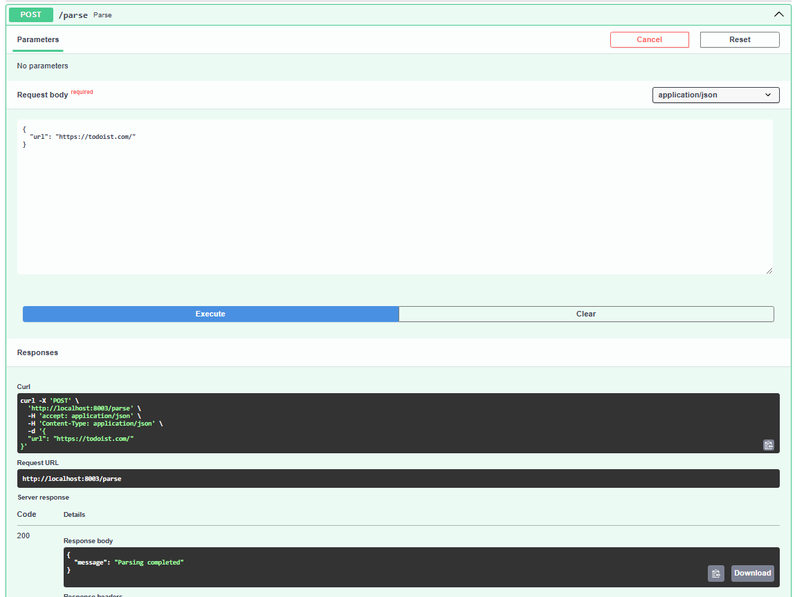

# Задача 1: Docker-контейнеризация FastAPI приложения с БД и парсером

## Этапы реализации

### 1. FastAPI приложение
Разработано в лабораторной работе №1.

### 2. База данных
PostgreSQL, настроена в лабораторной работе №1.

### 3. Парсер данных
Синхронный парсер из лабораторной работы №2. Выбор синхронного подхода обусловлен сохранением единой архитектуры с основным приложением.

### 4. HTTP-интерфейс для парсера

```python
from fastapi import FastAPI, HTTPException, status
from pydantic import BaseModel
import requests

from src.parse_and_save import parse_and_save
from src.connection import init_db


app = FastAPI()

class ParseRequest(BaseModel):
    url: str

@app.on_event("startup")
def on_startup():
    init_db()

@app.post("/parse")
def parse(request: ParseRequest):
    try:
        response = requests.get(request.url)
        response.raise_for_status()
        parse_and_save(request.url)
        return {"message": "Парсинг завершён"}
    except requests.RequestException as e:
        raise HTTPException(status_code=status.HTTP_500_INTERNAL_SERVER_ERROR, detail=str(e))
```

### 5. Dockerfile
Не создавался отдельно — образы формируются напрямую в docker-compose.

### 6. Docker Compose

```yaml
services:
  postgres-web:
    image: postgres:latest
    container_name: postgres-web
    hostname: postgres
    ports:
      - "5432:5432"
    environment:
      POSTGRES_USER: ${POSTGRES_USER}
      POSTGRES_PASSWORD: ${POSTGRES_PASSWORD}
      POSTGRES_DB: ${POSTGRES_DB}
    volumes:
      - postgres-data:/var/lib/postgresql/data

  sheduler:
    image: python:3.12
    working_dir: /sheduler
    command: >
      sh -c "cp /tmp/sheduler/requirements.txt . &&
             pip install --no-cache-dir -r requirements.txt &&
             mkdir -p /sheduler/data /sheduler/logs &&
             uvicorn src.main:app --reload --workers 1 --host 0.0.0.0 --port 8000"
    environment:
      POSTGRES_USER: ${POSTGRES_USER}
      POSTGRES_PASSWORD: ${POSTGRES_PASSWORD}
      POSTGRES_DB: ${POSTGRES_DB}
      POSTGRES_HOST: postgres
    volumes:
      - ./sheduler/src/:/sheduler/src/
      - ./sheduler/requirements.txt:/tmp/sheduler/requirements.txt
    ports:
      - "8002:8000"
    depends_on:
      - postgres-web
      - parser

  parser:
    image: python:3.12
    working_dir: /parser
    command: >
      sh -c "cp /tmp/parser/requirements.txt . &&
             pip install --no-cache-dir -r requirements.txt &&
             mkdir -p /parser/data /parser/logs &&
             uvicorn src.main:app --reload --workers 1 --host 0.0.0.0 --port 8000"
    environment:
      POSTGRES_USER: ${POSTGRES_USER}
      POSTGRES_PASSWORD: ${POSTGRES_PASSWORD}
      POSTGRES_DB: ${POSTGRES_DB}
      POSTGRES_HOST: postgres
    volumes:
      - ./parser/src/:/parser/src/
      - ./parser/requirements.txt:/tmp/parser/requirements.txt
    ports:
      - "8003:8000"
    depends_on:
      - postgres-web

volumes:
  postgres-data:
```

## Результат работы


